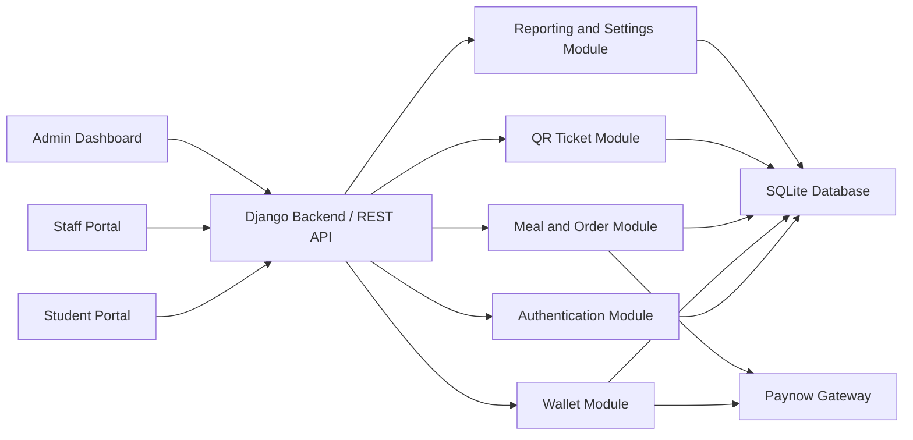
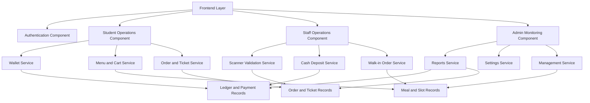
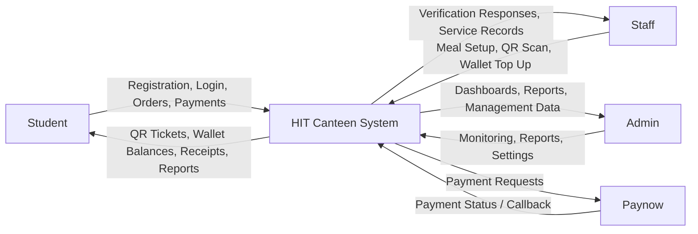
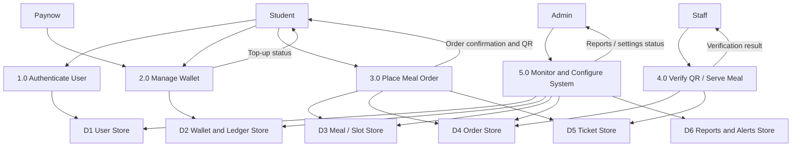
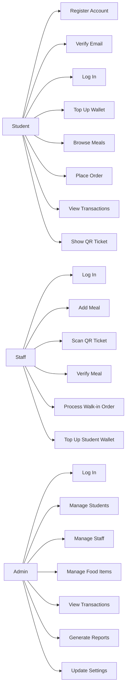
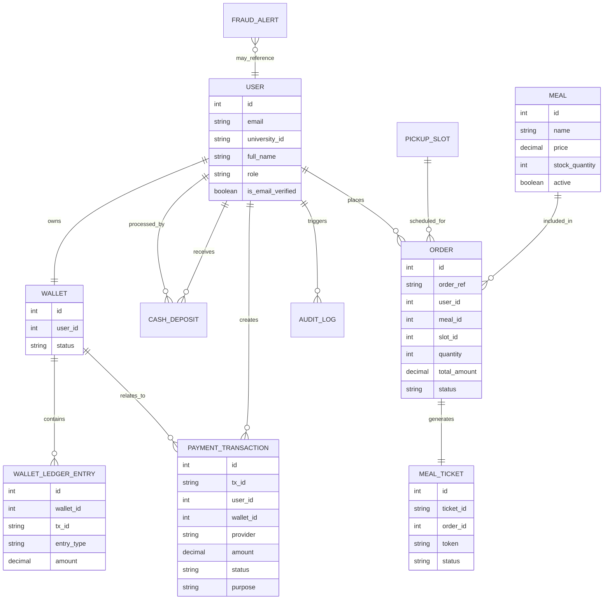
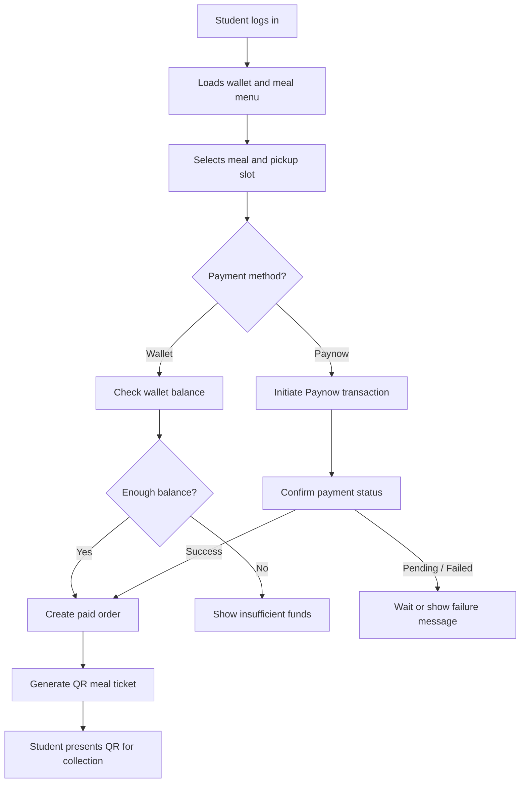
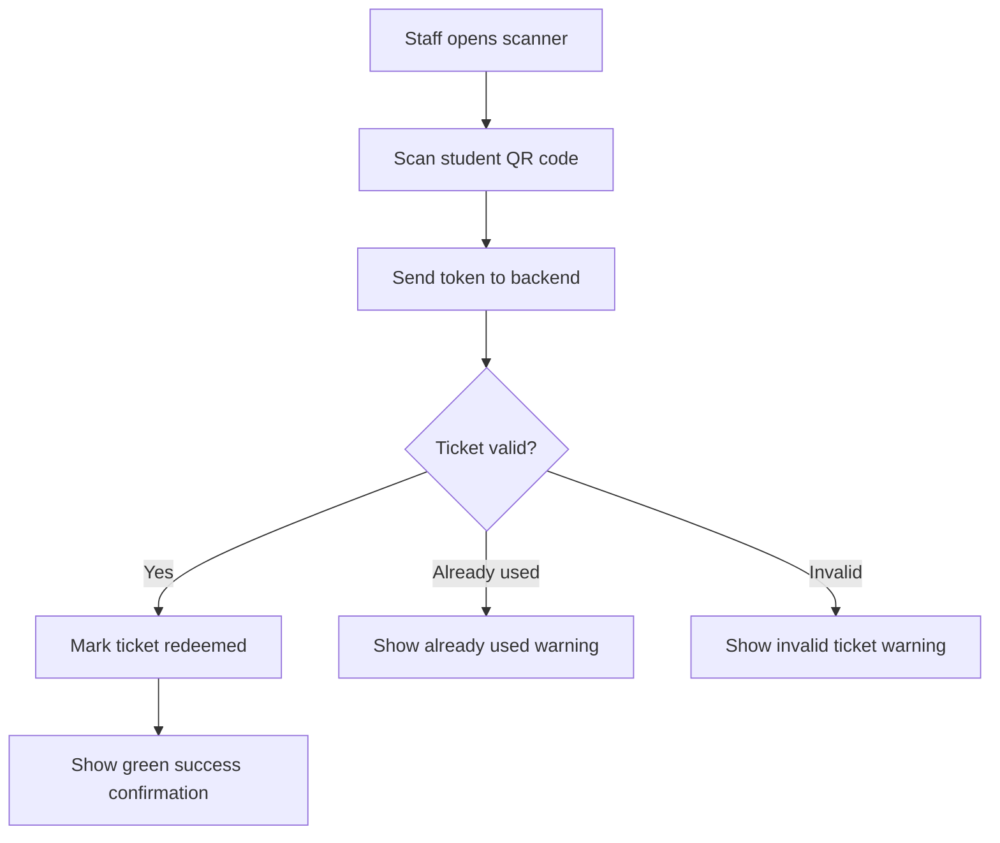

# HIT400 Prototype System Documentation Report Draft

## Title Page

**Project Title:** HIT Canteen Digital Payment and Meal Verification System  
**Student Name:** [Your Name]  
**Registration Number:** [Your Registration Number]  
**Programme:** [Your Programme]  
**Department:** [Your Department]  
**Institution:** Harare Institute of Technology  
**Course:** HIT400  
**Supervisor:** [Supervisor Name]  
**Date:** [Submission Date]

---

## Abstract

The HIT Canteen Digital Payment and Meal Verification System is a web-based prototype developed to modernize meal payment, ordering, and verification processes within a university canteen environment. The system was designed in response to challenges associated with manual cash handling, slow payment confirmation, long service queues, weak transaction traceability, and limited administrative oversight. The prototype introduces a role-based digital platform for students, staff members, and administrators.

Students use the platform to register, verify their email addresses, fund digital wallets, browse meals, place orders, make payments, and generate QR-based meal tickets. Staff members use the system to manage meals, verify purchases through QR scanning, process walk-in orders, and top up student wallets using cash at the counter. Administrators use the dashboard to monitor users, transactions, reports, food items, and system settings. The system integrates secure authentication, wallet ledger accounting, QR-based ticket validation, payment transaction logging, and reporting functions.

The prototype was implemented using Django and Django REST Framework on the backend, with responsive HTML, CSS, and JavaScript on the frontend. Supporting technologies include Paynow integration for online top-ups, QR code generation and scanning tools, and SQLite for persistence during development. The report presents the system background, architecture, design decisions, implementation approach, user interfaces, testing, and user guidance. The prototype demonstrates that a digital canteen platform can improve efficiency, security, accountability, and convenience for all users within the HIT canteen environment.

---

# 1. Introduction

## 1.1 Background to the System

University canteens serve a large number of students and staff within limited time periods. In many cases, meal payment and verification are still managed through manual processes that depend heavily on cash, verbal confirmation, and paper-based tracking. These methods often lead to long queues, delays in service, weak accountability, and difficulty in monitoring daily canteen operations.

The HIT Canteen Digital Payment and Meal Verification System was developed as a prototype to address these problems. The system introduces a structured digital environment in which students can manage meal payments electronically, staff can verify purchases quickly, and administrators can monitor the overall operation using a central dashboard. The design of the prototype aligns with the institutional need for more efficient service delivery and better financial control in campus operations.

## 1.2 Problem Statement

The traditional canteen process is inefficient because it depends on manual cash handling, slow payment verification, and fragmented record keeping. Students may experience delays while making payments or collecting meals, staff may struggle to verify whether a meal has already been paid for, and administrators may have limited visibility into transaction flows, meal demand, and service performance. These issues reduce service efficiency and create opportunities for fraud, duplication, and poor financial accountability.

## 1.3 Functional Objectives of the Prototype

The functional objectives of the prototype are:

1. To allow users to create accounts and log in based on their system roles.
2. To allow students to verify their accounts through email confirmation.
3. To allow students to fund their wallets and manage digital balances.
4. To allow students to browse available meals and place meal orders.
5. To generate QR meal tickets after successful payment.
6. To allow staff members to scan and verify student QR meal tickets.
7. To allow staff members to process walk-in orders and cash wallet top-ups.
8. To allow administrators to monitor transactions, users, food items, reports, and settings.

## 1.4 Non-Functional Objectives of the Prototype

The non-functional objectives of the prototype are:

1. To provide a user-friendly and responsive interface across phones, tablets, and laptops.
2. To improve security through email verification, role-based access control, and QR validation.
3. To ensure transaction traceability through logs, wallet ledger entries, and payment records.
4. To support reliable performance during peak canteen usage periods.
5. To provide a maintainable design using clear modules and structured backend services.

## 1.5 Scope of the System

The scope of the system includes student registration and login, wallet funding, digital ordering, QR ticket generation, QR validation, meal management, staff-assisted wallet top-ups, walk-in order handling, administrative reporting, and settings management. The prototype focuses on the operational needs of the HIT canteen and is implemented as a web-based system with responsive user interfaces.

## 1.6 Limitations of the Prototype

The prototype has several limitations. First, it is not yet deployed as a full production system. Second, live online payment behavior depends on third-party gateway availability and configuration. Third, the system was built around the needs of one institutional canteen, meaning broader multi-campus deployment would require additional scaling and policy features. Finally, while the prototype includes core reporting and monitoring tools, advanced analytics and deeper forecasting can still be expanded.

## 1.7 Organization of the Document

This report is organized into the following sections: Introduction, System Overview, System Architecture and Design, Technologies and Tools Used, System Implementation, User Interface Design and Screenshots, System Testing and Evaluation, User Guide, Discussion, and Conclusion.

---

# 2. System Overview

## 2.1 General Description of the System

The HIT Canteen Digital Payment and Meal Verification System is a role-based web application that supports three types of users: students, staff, and administrators. The system digitizes the payment and meal collection lifecycle from account creation to payment verification. It combines wallet-based transactions, QR ticketing, staff-assisted functions, and administrative control tools into one platform.

## 2.2 Core Functionalities and Features

The system provides the following core functions:

1. User registration and email verification.
2. Secure login and role-based portal access.
3. Student wallet management.
4. Online wallet top-up initiation and transaction tracking.
5. Manual cash wallet top-up by staff.
6. Meal listing and ordering.
7. Pickup slot selection.
8. QR meal ticket generation.
9. Staff QR ticket validation.
10. Walk-in order service for non-prebooked customers.
11. Admin reporting and analytics.
12. Audit and fraud alert support.

## 2.3 Intended Users

### Students

Students use the system to register, verify accounts, fund wallets, browse meals, place orders, view transactions, and display QR tickets for meal collection.

### Staff Members

Staff members use the system to add meals, verify student QR tickets, top up student wallets at the counter, process walk-in orders, and monitor daily operational activities.

### Administrators

Administrators use the dashboard to manage users, food items, transaction records, reports, and system settings.

## 2.4 Operational Environment

The prototype is web-based. It is designed to be mobile-first for student and staff users and desktop-friendly for administrators. The backend runs on Django, the frontend uses browser-based interfaces, and the prototype can be tested locally or through a public tunnel such as ngrok when callback URLs are required.

---

# 3. System Architecture and Design

## 3.1 System Architecture

The system follows a client-server architecture. The frontend delivers role-specific user interfaces through HTML templates, CSS styling, and JavaScript behaviors. The backend exposes application logic and API endpoints through Django and Django REST Framework. Data is stored in a relational database and linked through models representing users, wallets, payments, meals, orders, tickets, and reports.

At a high level, the architecture contains:

1. Presentation layer: student, staff, and admin interfaces.
2. Application layer: authentication, wallet, order, QR, reporting, and settings services.
3. Data layer: database models and transactional records.
4. External integration layer: Paynow payment initiation and callback handling.

**Figure 3.1: System Architecture Diagram**

**Explanation:**  
Figure 3.1 shows the overall structure of the prototype. Students, staff, and administrators interact with separate frontend interfaces, but all requests are processed by a single Django backend. The backend is modularized into authentication, wallet, order, QR, and reporting services. These services use the central database for persistent storage. Online payment requests additionally connect to the Paynow gateway, while verification and reporting remain internal to the system.

## 3.2 Module and Component Design

The major modules of the prototype are:

### Authentication Module

Handles registration, email verification, login, password change, profile updates, and role-based access control.

### Wallet Module

Maintains wallet ownership and tracks all credits and debits using ledger entries. This ensures balances can be audited rather than stored as manually overwritten totals.

### Payment Module

Manages online top-up initiation, payment transaction records, provider callbacks, and transaction status updates.

### Meal Management Module

Supports meal creation, stock quantity control, active availability, and staff/admin viewing interfaces.

### Order Management Module

Allows students to place orders, choose pickup slots, create ticket records, and track order state from payment to service.

### QR Verification Module

Generates one-time QR meal tickets and allows staff to scan and redeem them.

### Reporting and Monitoring Module

Provides transaction history, daily reconciliation, fraud monitoring, demand forecasting, and summarized admin reporting.

**Figure 3.2: Module and Component Design**

**Explanation:**  
Figure 3.2 breaks the system into functional modules. The student side centers on wallet management, menu browsing, and order placement. The staff side focuses on scanning, deposits, and walk-in processing. The admin side supports reporting, settings, and management tasks. This separation improves maintainability because each component has a clearly defined responsibility.

## 3.3 Data Flow Explanation

The main data flows in the prototype are:

1. The student submits login credentials to the authentication endpoint.
2. The backend validates credentials and returns a token and role information.
3. The student loads wallet and menu information from the backend.
4. When an order is placed, the backend validates balance or payment state, deducts or confirms payment, and creates an order.
5. The backend generates a QR ticket associated with the paid order.
6. The staff scanner reads the QR token and submits it to the validation endpoint.
7. The backend checks ticket status and returns a valid, invalid, or already-used response.
8. Reporting modules read transactions and orders to produce operational summaries.

**Figure 3.3: Context Data Flow Diagram**

**Explanation:**  
Figure 3.3 is a context-level DFD. It treats the HIT Canteen system as one central process and shows the external entities that interact with it. Students provide registration, payment, and order data. Staff provide scanning and service actions. Administrators provide management and oversight actions. Paynow acts as the external payment service.

**Figure 3.4: Level 1 Data Flow Diagram**

**Explanation:**  
Figure 3.4 expands the system into its key operational processes. Authentication writes and reads user data. Wallet management uses ledger and payment records. Order placement consumes meal and slot information and creates orders and tickets. Staff validation checks order and ticket data. Administrative monitoring reads from all major stores to generate reports and control the system.

## 3.4 Use Case Design

The main actors are Student, Staff, and Admin.

### Student Use Cases

- Register account
- Verify email
- Log in
- Add money
- View wallet balance
- Browse meals
- Place order
- View transactions
- Show QR ticket

### Staff Use Cases

- Log in
- Add meal
- Scan QR code
- Verify meal
- Process walk-in order
- Top up student wallet

### Admin Use Cases

- Log in
- Manage students
- Manage staff
- Manage food items
- View transactions
- Generate reports
- Update system settings

**Figure 3.5: Use Case Diagram**

**Explanation:**  
Figure 3.5 summarizes the system responsibilities according to role. Students focus on account access, payment, ordering, and ticket presentation. Staff focus on service delivery and meal verification. Administrators focus on oversight and configuration. This role separation supports security and clarity of operation.

## 3.5 Database Design

The prototype includes the following major entities:

1. **User**: stores email, university ID, full name, role, verification status, and access flags.
2. **Wallet**: links each user to a wallet account.
3. **WalletLedgerEntry**: stores wallet credits and debits for traceability.
4. **PaymentTransaction**: records online and order-related payment flows.
5. **CashDeposit**: records staff-assisted cash top-ups.
6. **Meal**: stores meal names, descriptions, prices, stock, and active state.
7. **PickupSlot**: stores available collection windows.
8. **Order**: stores paid meal orders.
9. **MealTicket**: stores QR ticket information.
10. **AuditLog**: stores traceable system actions.
11. **FraudAlert**: stores suspicious activity notices.
12. **DailyReconciliationReport**: stores summarized financial and service data.
13. **AdminSetting**: stores configurable system options.

The database design supports a normalized and traceable transaction flow suitable for a prototype with audit requirements.

**Figure 3.6: Entity Relationship Diagram**

**Explanation:**  
Figure 3.6 shows the core database relationships. Each user owns one wallet, and each wallet contains multiple ledger entries. Orders are linked to users, meals, and pickup slots, while each completed order generates one meal ticket. Payment transactions and cash deposits provide financial traceability. This structure supports accountability, QR verification, and reporting.

**Figure 3.7: Student Order Flowchart**

**Explanation:**  
Figure 3.7 focuses on the operational flow from the student perspective. The student logs in, selects a meal, chooses a payment path, and receives a QR code once the order is successfully paid for. This flowchart is useful because it clearly connects the wallet, payment, ordering, and ticketing processes.

**Figure 3.8: Staff Verification Flowchart**

**Explanation:**  
Figure 3.8 shows the meal verification process from the staff side. Once the QR code is scanned, the token is validated by the backend. A valid ticket is redeemed immediately, while invalid or previously used tickets are rejected. This one-time redemption logic helps prevent duplicate meal collection.

---

# 4. Technologies and Tools Used

## 4.1 Programming Languages

The prototype was built using:

- Python for backend logic
- JavaScript for frontend interaction
- HTML for page structure
- CSS for styling

## 4.2 Frameworks and Libraries

The main frameworks and libraries are:

- Django for the web backend
- Django REST Framework for API endpoints
- Simple JWT for token-based authentication
- qrcode utilities for QR generation
- html5-qrcode for browser-based scanning
- Tailwind CSS and custom CSS styles for responsive presentation

## 4.3 Development Tools

The development tools used include:

- Visual Studio Code
- PowerShell terminal
- Browser developer tools
- ngrok for public callback URL testing

## 4.4 Database System

SQLite was used during development because it is lightweight, easy to configure, and appropriate for a working prototype.

## 4.5 Justification of Technology Choices

Django was selected because it provides rapid development, strong security defaults, and a structured model-view architecture. Django REST Framework was chosen to simplify API construction and role-based responses. JavaScript was necessary for dynamic frontend actions such as login flows, wallet actions, cart behavior, and QR scanning. SQLite was suitable for prototype storage, while ngrok provided a practical way to expose local endpoints for gateway callbacks during testing.

---

# 5. System Implementation

## 5.1 Development Methodology

The system was developed using an iterative prototype approach. Core features were implemented first, then refined based on testing and observed user flow issues. This approach supported continuous improvement of login, wallet funding, QR verification, reporting, and role-based navigation.

## 5.2 Key System Components

### User Authentication and Role Handling

The authentication component supports account registration, email verification, secure login, and routing to the correct student, staff, or admin portal based on the returned user role.

### Wallet and Ledger Processing

Instead of storing a manually edited balance value, the prototype uses ledger entries to compute wallet balance. This improves accountability because every credit and debit is stored as a transaction event.

### Payment and Top-Up Processing

Online payment initiation is handled through Paynow integration, while staff can also perform counter-based cash top-ups. The system records payment status, callback state, and metadata for tracing and recovery.

### Meal Ordering and Ticket Issuance

Once a payment is confirmed, the system creates an order and generates a QR ticket linked to that order. The ticket contains a token and a visual QR representation.

### Ticket Verification

When staff scan a QR code, the backend validates the token and checks whether it is issued, redeemed, or invalid. Valid tickets are marked as redeemed to prevent duplicate service.

### Reporting and Forecasting

The reporting components summarize payments, orders, and service outcomes. The staff-facing forecast tools also estimate meal demand to support preparation planning.

## 5.3 Major Functionalities Implemented

The major functionalities implemented in the prototype are:

1. Student registration and email verification
2. Unified login with role-based redirection
3. Wallet top-up workflow
4. Student meal ordering
5. QR code generation for paid orders
6. Staff QR scanning and meal verification
7. Walk-in meal processing
8. Cash wallet deposit by staff
9. Admin reporting and settings management

## 5.4 Integration of System Modules

The modules are integrated through backend APIs and shared database entities. Authentication supports all portals. Wallet state supports both top-up and ordering. Orders create tickets. Staff validation updates service state. Admin reporting reads from payments, orders, alerts, and reconciliation records. This integration ensures that one completed action, such as successful payment, becomes available throughout the system.

## 5.5 Challenges Encountered and Solutions

Several challenges were encountered during prototype development:

1. **Frontend state inconsistency across pages**  
   This was addressed by standardizing shared JavaScript loading and unifying portal logic.

2. **Payment callback configuration issues**  
   Public callback URLs were required, and ngrok was used for local testing.

3. **Paynow initiation failure diagnostics**  
   Better validation and logging were introduced so gateway responses could be traced.

4. **QR page rendering issues**  
   The QR display was corrected by ensuring latest tickets were loaded dynamically.

5. **Staff scanner reliability**  
   The scanner flow was refined with stronger feedback, state handling, and clear success/failure indications.

## 5.6 Discussion of Implementation

The implementation demonstrates that a university canteen prototype can be built as a modular, role-based web application. The use of separate student, staff, and admin flows allowed the system to serve operational needs without overloading a single interface. The integration between wallet funding, ordering, and QR verification was a key success in showing end-to-end service delivery.

---

# 6. User Interface Design and System Screenshots

## 6.1 User Interface Design Principles

The prototype was designed using the HIT institutional color identity with blue and gold as dominant accents. The student and staff interfaces follow a mobile-first layout because those users are more likely to access the system during active canteen operations. The admin dashboard is more desktop-oriented to support reporting and management tasks.

The key design goals were:

1. clarity
2. speed of operation
3. minimal clutter
4. responsive layouts
5. strong visual distinction between primary actions and secondary information

## 6.2 Student Interfaces

The student interfaces include:

- login page
- dashboard
- add money page
- meal menu
- cart and checkout
- QR ticket page
- transactions page
- profile page

Each of these interfaces supports straightforward actions such as wallet review, ordering, and ticket display.

## 6.3 Staff Interfaces

The staff interfaces include:

- staff dashboard
- QR scanner page
- walk-in order section
- wallet top-up section
- meal management section

These screens prioritize fast canteen operations and large touch-friendly controls.

## 6.4 Admin Interfaces

The admin interfaces include:

- admin dashboard
- student management page
- staff management page
- food items page
- transactions page
- reports page
- settings page

These screens support supervision, analytics, and configuration.

## 6.5 Screenshot Guidance

In the final report, each screenshot should be inserted as a numbered figure with a caption and explanation. Example:

**Figure 6.1: Student Dashboard**  
This screen displays the student greeting, wallet balance, quick actions, and recent activity. It acts as the main landing page after successful login.

---

# 7. System Testing and Evaluation

## 7.1 Testing Strategies

Three forms of testing were applied to the prototype:

1. **Unit-oriented testing** for isolated backend functions and validations.
2. **Integration testing** for payment, ordering, QR generation, and QR verification flows.
3. **User testing** for basic navigation and task completion across student, staff, and admin roles.

## 7.2 Sample Test Cases

| Test Case ID | Function Tested | Input | Expected Result | Actual Result | Status |
|---|---|---|---|---|---|
| TC01 | Student login | Valid student credentials | Student portal opens | Portal opened correctly | Pass |
| TC02 | Staff login | Valid staff credentials | Staff portal opens | Portal opened correctly | Pass |
| TC03 | Admin login | Valid admin credentials | Admin dashboard opens | Dashboard opened correctly | Pass |
| TC04 | Wallet top-up request | Valid amount and email | Paynow request initiated | Redirect link generated | Pass |
| TC05 | Meal order placement | Valid meal and slot | Order created and paid | Order generated | Pass |
| TC06 | QR generation | Successful order | QR ticket created | QR displayed | Pass |
| TC07 | QR verification | Valid QR token | Ticket redeemed | Success response returned | Pass |
| TC08 | Duplicate scan | Previously redeemed QR | Reject duplicate use | Already used response returned | Pass |
| TC09 | Cash deposit | Valid student ID and amount | Wallet credited | Ledger and deposit created | Pass |
| TC10 | Admin reports | Existing transaction data | Reports load | Reports displayed | Pass |

## 7.3 Results and Analysis

Testing showed that the core prototype functions operate as expected under the main user flows. Login, wallet loading, meal browsing, cart handling, QR generation, QR scanning, and administrative reporting all function within the expected role boundaries. Some third-party payment behavior required additional troubleshooting and callback configuration, but the overall system proved capable of supporting the intended operational scenario.

## 7.4 System Performance and Reliability

The prototype performs reliably in local and guided testing conditions. Because the architecture separates concerns between authentication, wallet management, ordering, and verification, failures in one area are easier to isolate and diagnose. Ledger-based wallet tracking and one-time QR validation improve operational confidence and auditability.

---

# 8. User Guide

## 8.1 Installation and Setup

To run the prototype:

1. Install project dependencies.
2. Activate the virtual environment.
3. Run database migrations.
4. Start the Django development server.
5. Open the web interface in a browser.
6. Use ngrok if public callback URLs are needed for payment testing.

## 8.2 System Operation and Navigation

### Student

The student logs in, views wallet balance, adds money, browses meals, places an order, and presents the generated QR code for verification.

### Staff

The staff member logs in, manages meals, scans QR tickets, performs walk-in orders, and tops up student wallets.

### Admin

The administrator logs in, reviews reports, manages users and meals, monitors transactions, and updates settings.

## 8.3 Key Functionalities

The most important system functions are:

1. student wallet funding
2. meal ordering
3. QR ticket generation
4. QR verification
5. cash wallet deposit
6. admin reporting

## 8.4 Basic Troubleshooting

Common troubleshooting steps include:

1. Hard refresh the browser if frontend changes are not appearing.
2. Restart Django after settings or route updates.
3. Confirm public callback URLs for online payment testing.
4. Check valid user credentials and role permissions.
5. Confirm that ticket status has not already been redeemed.

---

# 9. Discussion

The prototype demonstrates that a digital canteen system can significantly improve payment handling and meal verification in a university environment. It replaces slow manual workflows with a structured platform that gives each user group tools that match their responsibilities. Students benefit from convenience and faster service, staff benefit from quick verification and clearer workflows, and administrators benefit from traceable records and operational visibility.

One of the strongest design decisions in the prototype is the separation of user responsibilities through role-based interfaces. Another important decision is the use of wallet ledger entries instead of a fragile direct-balance update approach. QR verification also adds practical value because it creates a fast and secure handoff between student payment and staff service delivery.

The prototype remains an academic system and would benefit from further production hardening, but it is already suitable as a functional demonstration of the proposed solution.

---

# 10. Conclusion

This report presented the design, implementation, and evaluation of the HIT Canteen Digital Payment and Meal Verification System prototype. The system was developed to address challenges in traditional canteen operations, including slow payment processing, manual verification, weak accountability, and limited administrative insight.

The prototype successfully demonstrates a working digital model involving student wallets, meal ordering, QR ticket generation, staff validation, and administrative monitoring. The architecture, design, and implementation choices show that the proposed solution is appropriate for the identified problem. Overall, the system provides a practical and modern approach to improving canteen services at Harare Institute of Technology.

---

# References

Use Harvard style for all references included in the final version. Typical sources may include:

- Django documentation
- Django REST Framework documentation
- Paynow integration documentation
- QR code library documentation
- Academic sources on digital payment systems and university service automation

---

# Appendices

The appendices should include:

1. Extended code listings
2. Additional system screenshots
3. Configuration details
4. Sample test data
5. API request and response examples
