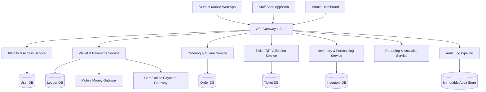

# HIT Canteen Digital Payment & Management System Design

## 1. Objectives

Build a secure, mobile-first canteen platform for the Harare Institute of Technology (HIT) that replaces paper tickets and achieves:

- Eliminate ticket duplication fraud.
- Reduce canteen queues and serving congestion.
- Improve demand forecasting to cut food shortages and wastage.
- Increase financial transparency and accountability.

## 2. Core Users and Roles

- Student: register account, top up wallet, view menu, pre-order meals, receive QR ticket, collect meal.
- Canteen Cashier/Server: scan QR tickets, validate orders, mark meals served.
- Kitchen Manager: monitor incoming orders, prep volume by time slot, inventory usage.
- Finance/Admin: monitor transactions, reconcile wallet balances, generate reports.
- Security/Auditor: review audit logs, fraud alerts, privileged actions.

Role-based access control (RBAC) ensures each role sees only necessary functions.

## 3. High-Level Architecture

Recommended deployment model:

- Frontend: responsive web app (PWA) for students and staff.
- Backend: modular services (or modular monolith initially) with REST APIs.
- Database: PostgreSQL for transactional integrity.
- Cache/queue: Redis for session cache, queue estimates, and async jobs.
- Object storage: invoices/exports.

## 4. Key Functional Design

### 4.1 Student Digital Accounts

- Registration inputs:
  - Student ID (validated against university registry import/API).
  - Name, email/phone, password or SSO (if HIT identity provider exists).
- Wallet:
  - Each student has one wallet account.
  - Double-entry ledger records every credit/debit.
  - Wallet balance is computed from ledger entries (not mutable by direct edit).
- Top-up channels:
  - Mobile money.
  - Bank card payments.
  - Online transfer/payment gateway.

Controls:

- KYC-lite checks tied to valid student ID.
- Daily top-up and spending limits (configurable).
- Real-time payment callback verification with signed webhooks.

### 4.2 QR Code / Digital Meal Ticket

- On successful meal purchase, generate ticket with:
  - `ticket_id` (UUIDv7),
  - `order_id`, `student_id`, `meal_id`, `timeslot_id`,
  - cryptographic signature (HMAC-SHA256 or JWT signature),
  - short expiry window (e.g., until end of pickup slot + grace period).
- Ticket states:
  - `ISSUED -> SCANNED -> REDEEMED` (or `EXPIRED` / `CANCELLED`).
- One-time usage enforcement:
  - Atomic DB transaction updates state only once.
  - Replay attempts trigger fraud alert.

Controls:

- Signed QR payload prevents forged codes.
- Server-side validation required; never trust scanner-side data.
- Offline fallback (optional): short-lived signed token with sync and conflict rules.

### 4.3 Online Meal Ordering

- Students view daily/weekly menu:
  - meal name, price, ingredients/allergens, availability, prep time.
- Pre-order flow:
  - select meal + quantity,
  - choose pickup time slot,
  - pay from wallet,
  - receive digital QR ticket.

Controls:

- Slot capacity limits to avoid overbooking.
- Meal cut-off times (e.g., orders close 30 min before slot).
- Auto-disable items when inventory threshold reached.

### 4.4 Queue Management

- Slot-based distribution:
  - e.g., 12:00-12:15, 12:15-12:30.
- Estimated wait time (EWT) engine:
  - Inputs: active queue length, average serve rate, staff count.
  - Output shown live on student app and staff dashboard.
- Optional virtual queue tokens for walk-ins.

Outcome:

- Reduced physical crowding.
- Predictable serving flow.

### 4.5 Food Demand Forecasting

Data captured daily:

- Meals ordered per item, per slot, per weekday.
- No-show rates, cancellation rates.
- Inventory consumption and leftovers.

Forecasting approach (phased):

- Phase 1: Moving averages + weekday seasonality.
- Phase 2: Time-series model (Prophet/ARIMA/XGBoost features).
- Phase 3: Incorporate academic calendar/events/exam periods/weather.

Outputs:

- Recommended prep quantity per meal and slot.
- Expected demand confidence range.
- Suggested procurement quantities.

### 4.6 Admin Dashboard

Views:

- Financial: top-ups, wallet debits, revenue, refunds, unsettled payments.
- Operations: orders by slot, average wait time, fulfillment rate.
- Inventory: stock levels, depletion risk, wastage estimate.
- Fraud/risk: duplicate scan attempts, failed validations, abnormal transaction patterns.

Reports:

- Daily reconciliation report.
- Weekly sales and margin report.
- Monthly audit trail export.
- Fraud incident report.

## 5. Security Architecture

### 5.1 Authentication and Authorization

- Passwords hashed with Argon2id or bcrypt (high work factor).
- MFA for staff/admin accounts.
- Short-lived access tokens + refresh token rotation.
- RBAC with least privilege and endpoint-level policy checks.

### 5.2 Data Protection

- TLS 1.2+ for all traffic.
- Encryption at rest for databases and backups.
- Sensitive fields encrypted application-side where needed.
- Secrets stored in vault/KMS, never in source code.

### 5.3 Transaction Integrity

- Unique transaction IDs for all financial and ticket actions.
- Idempotency keys for payment and order APIs.
- ACID transactions for wallet debit + order creation + ticket issue.
- Reconciliation jobs compare gateway settlements with internal ledger.

### 5.4 QR and Fraud Prevention

- One-time token redemption with row-level lock/atomic update.
- Strict TTL and signature validation.
- Device/IP fingerprinting for high-risk behavior.
- Rate limiting and bot protection on auth/payment/ticket endpoints.

### 5.5 Audit and Monitoring

- Immutable audit logs for:
  - logins/logouts,
  - role changes,
  - wallet mutations,
  - ticket validation attempts,
  - admin overrides/refunds.
- Centralized SIEM-compatible logs with alert rules.
- Retention policy and tamper detection.

## 6. Data Model (Core Tables)

- `students` (student_id, reg_number, status, created_at)
- `users` (user_id, student_id nullable, role, email, password_hash, mfa_enabled)
- `wallet_accounts` (wallet_id, student_id, status)
- `wallet_ledger_entries` (entry_id, wallet_id, type, amount, currency, reference_id, created_at)
- `payment_transactions` (tx_id, provider, provider_ref, amount, status, idempotency_key)
- `meals` (meal_id, name, price, active, nutrition_meta)
- `menu_items` (menu_item_id, date, meal_id, available_qty, cutoff_time)
- `pickup_slots` (slot_id, date, start_time, end_time, capacity)
- `orders` (order_id, student_id, total_amount, status, slot_id, created_at)
- `order_items` (order_item_id, order_id, meal_id, qty, unit_price)
- `meal_tickets` (ticket_id, order_id, qr_payload_hash, status, expires_at, redeemed_at)
- `inventory_items` (item_id, name, unit, current_stock, reorder_level)
- `inventory_movements` (move_id, item_id, type, qty, reference)
- `audit_logs` (log_id, actor_user_id, action, entity, entity_id, ip, user_agent, ts, hash_chain)
- `fraud_alerts` (alert_id, type, severity, details, status, created_at)

## 7. Critical Workflows

### 7.1 Registration & Wallet Setup

1. Student enters university ID and profile details.
2. System validates ID against registry.
3. User account + wallet account created.
4. Audit log recorded.

### 7.2 Top-Up and Payment

1. Student initiates top-up.
2. Payment gateway authorization/callback received.
3. Ledger credit posted after verified callback.
4. Student places order; wallet debited atomically.

### 7.3 Ticket Redemption

1. Student presents QR at serving point.
2. Staff scanner submits ticket token.
3. Server verifies signature, expiry, state.
4. If valid, mark ticket redeemed atomically and return success.
5. Duplicate/replay attempts denied and logged as alerts.

## 8. UI/UX (Mobile-First)

Student app screens:

- Sign up / sign in.
- Wallet balance and top-up.
- Daily menu and allergens.
- Cart and checkout.
- Ticket wallet (active QR + pickup slot + countdown).
- Order history and receipts.

Staff screens:

- Fast scan screen with large validation status.
- Queue monitor per slot.
- Manual override (restricted, audited).

Admin screens:

- KPI dashboard.
- Fraud and anomalies panel.
- Financial reconciliation and exports.

Mobile design rules:

- Responsive layout for low-end Android devices.
- Low bandwidth optimization (compressed assets, pagination).
- High contrast and large tap targets.

## 9. Non-Functional Requirements

- Availability target: 99.9% during meal hours.
- Ticket validation latency: < 300 ms p95.
- Payment/order APIs: < 500 ms p95.
- Scalability: at least peak lunchtime concurrent load.
- Backups: hourly incremental, daily full backup.
- Disaster recovery: RPO <= 15 min, RTO <= 1 hour.

## 10. Implementation Plan (Phased)

### Phase 1 (MVP, 8-12 weeks)

- Student accounts + wallet top-up.
- Menu, pre-order, checkout.
- QR ticket generation and one-time scan validation.
- Basic admin dashboard and reports.
- Audit logging and RBAC.

### Phase 2 (4-6 weeks)

- Queue prediction and real-time EWT.
- Fraud scoring and anomaly alerts.
- Inventory linkage and stock depletion warnings.

### Phase 3 (4-8 weeks)

- Advanced demand forecasting model.
- Procurement planning recommendations.
- Deeper finance integrations and automated reconciliation.

## 11. Governance and Operational Controls

- Segregation of duties:
  - cashier cannot alter financial reports,
  - admin cannot edit immutable audit records.
- Maker-checker flow for refunds/manual adjustments.
- Quarterly penetration testing and vulnerability scans.
- Incident response playbook for fraud/security events.

## 12. Success Metrics

- Fraud reduction: duplicate ticket incidents down by >= 95%.
- Queue performance: average wait time reduced by >= 50%.
- Forecast accuracy: meal demand MAPE < 15% after 2 months of data.
- Waste reduction: leftover food reduced by >= 30%.
- Adoption: >= 85% of canteen transactions digital within one semester.

## 13. Recommended Technology Stack

- Frontend: React + TypeScript + Tailwind (PWA-capable).
- Backend: Node.js (NestJS/Express) or Python (Django + DRF).
- Database: PostgreSQL.
- Cache/queue: Redis + background workers.
- QR: signed JWT/HMAC payloads + server-side state.
- Payments: aggregator supporting Zimbabwe mobile money and cards.
- Observability: OpenTelemetry + Grafana/ELK stack.

This design directly addresses HIT's current pain points by replacing paper tickets with cryptographically verifiable digital tickets, adding wallet-based cashless payments, distributing demand by pickup slots, and using analytics-driven production planning.

## 14. API Surface (Starter Contract)

Authentication:

- `POST /api/v1/auth/register-student`
- `POST /api/v1/auth/login`
- `POST /api/v1/auth/refresh`
- `POST /api/v1/auth/logout`

Wallet and payments:

- `GET /api/v1/wallet`
- `POST /api/v1/wallet/topup/initiate`
- `POST /api/v1/payments/webhook/{provider}`
- `GET /api/v1/wallet/ledger`

Menu and ordering:

- `GET /api/v1/menu?date=YYYY-MM-DD`
- `GET /api/v1/pickup-slots?date=YYYY-MM-DD`
- `POST /api/v1/orders`
- `GET /api/v1/orders/{order_id}`
- `POST /api/v1/orders/{order_id}/cancel`

Tickets and scanning:

- `GET /api/v1/tickets/{order_id}`
- `POST /api/v1/tickets/validate-scan`
- `POST /api/v1/tickets/{ticket_id}/manual-override` (admin/supervisor only, fully audited)

Admin and analytics:

- `GET /api/v1/admin/kpis`
- `GET /api/v1/admin/reports/revenue`
- `GET /api/v1/admin/reports/fraud-alerts`
- `GET /api/v1/admin/reports/demand-forecast`

API security baseline:

- OAuth2/JWT bearer tokens for user APIs.
- mTLS or signed requests for internal service calls.
- Idempotency header required for payment and order creation endpoints.
